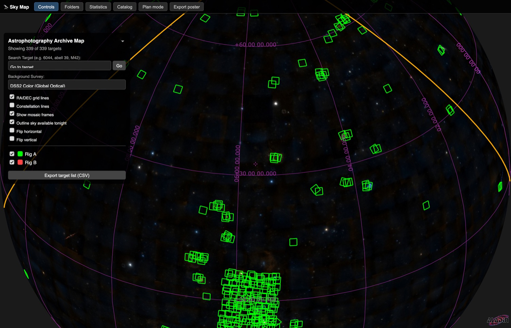
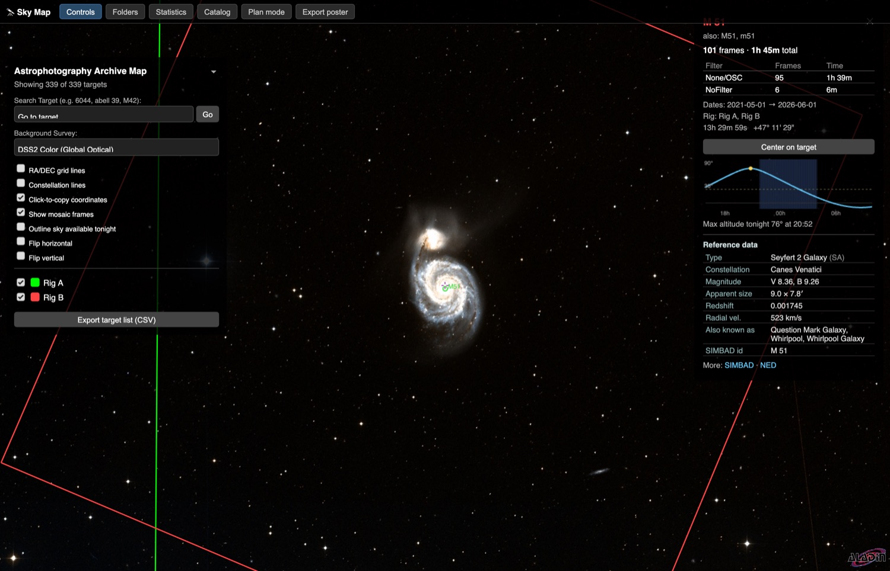
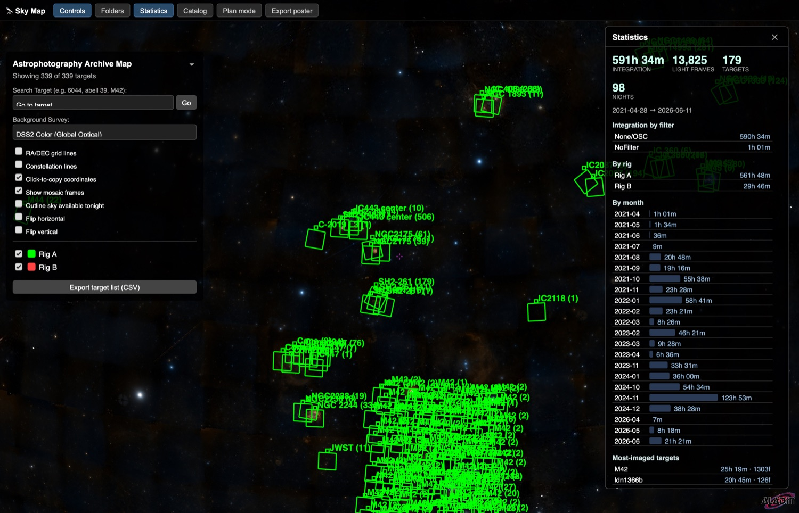
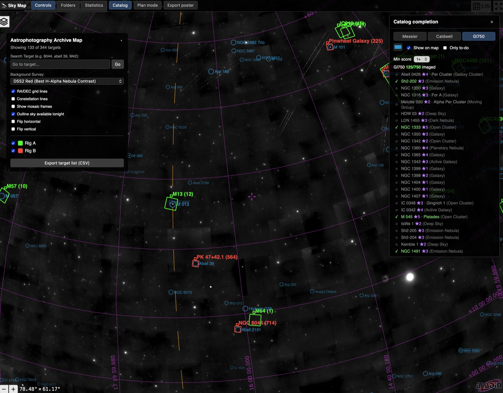
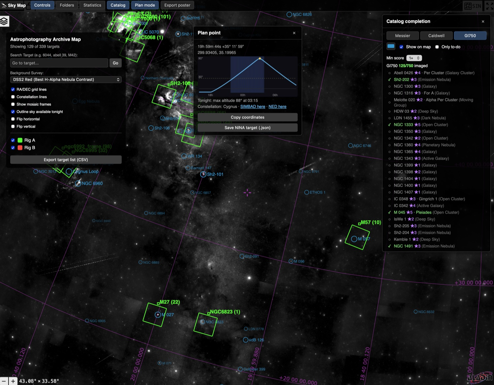

# Sky Mapper — Astrophotography Archive Map

Catalog every image you've ever shot and see them plotted on an interactive sky map.
Sky Mapper scans your FITS/XISF files, reads their coordinates straight from the
headers (plate‑solved WCS where available), and draws each frame's true footprint —
correct size and rotation — over real sky surveys. It's part observing log, part
coverage map, and part planning tool: see what you've captured, what you've missed,
and what's worth shooting tonight.



The map is rendered with [Aladin Lite](https://aladin.cds.unistra.fr/AladinLite/);
a small local Python web server feeds it your data and answers a few API calls
(file headers, SIMBAD lookups, rescans).

---

## Features

### Interactive coverage map
- Every light frame drawn as a footprint at its **true field of view and camera
  rotation**, computed from `FOCALLEN` / pixel size and the solved WCS.
- One **color per rig/telescope**; nearby frames are clustered into one labeled
  target so the map stays readable.
- Switch between sky surveys (DSS2 color/red, DESI Legacy, PanSTARRS, Mellinger,
  Finkbeiner Hα, 2MASS, AllWISE), toggle an **RA/Dec grid** and **constellation
  lines**, **flip** the view horizontally/vertically to match your eyepiece or
  camera, and search for any object by name.

### Image folder browser
- A tree of your image folders (one root per rig). Expand to individual files.
- **Click a folder** to outline its frames on the map in a customizable highlight
  color; **click a file** to highlight it *and* pop up its **full FITS/XISF header**
  in a clean, scrollable view.
- **Click a footprint on the map** to jump the browser to the folder(s) containing
  that target — even across multiple imaging nights.

### Target details + reference data


Click a footprint to open a details panel with:
- Frame count and **total integration time, broken down per filter**, plus the date
  range and which rig(s) shot it.
- A **tonight altitude curve** for the target (transit time and maximum altitude),
  using your observing site.
- **Reference data from SIMBAD** — object type, constellation, magnitudes, angular
  size, redshift/radial velocity, common names — with links out to SIMBAD and NED.

### Statistics dashboard


Total integration time, light‑frame count, targets, and nights imaged; integration
broken down **by filter, by rig, and by month**; a most‑imaged‑targets leaderboard;
and median capture conditions (altitude, airmass, temperatures) pulled from headers.

### Messier & Caldwell completion


Overlay the Messier and Caldwell catalogs to track your "collection." Objects you've
already captured show a green ✓; the rest show a gray ○. Filter to **only the
to‑do objects** to decide what to image next, and click any entry to fly to it.

### Plan mode


Turn on **Plan mode** and click any patch of sky to get a planning popup:
- A **tonight altitude curve** with the astronomical‑dark window shaded.
- The **constellation** and links to SIMBAD/NED for that position.
- **Copy coordinates** to the clipboard, or **download a NINA‑importable target
  file** (Telescopius‑format CSV) to load straight into your acquisition software.

### Everything else
- **"Available tonight" outline** — draws the region of sky that climbs above your
  minimum altitude during tonight's darkness.
- **Rescan buttons** (per rig or all) — re‑scan disk for added/deleted files and
  rebuild the map without leaving the browser.
- **Export target list (CSV)** of every catalogued target, and **Export poster
  (PNG)** of the current map view.
- A **menu bar** to show/hide each panel for a decluttered screen; panels are
  draggable and their positions/visibility persist between sessions.
- Calibration frames (dark/flat/bias), mosaics, and coordinate‑less test frames are
  detected and handled automatically.

---

## Requirements

- **Python 3.10 or newer**
- **[Astropy](https://www.astropy.org/)** (the only third‑party dependency; it pulls
  in NumPy automatically) — see [`requirements.txt`](requirements.txt)
- A modern web browser
- Internet access (for Aladin survey tiles, SIMBAD reference data, and a one‑time
  download of constellation‑line data)

---

## Installation

```bash
# 1. Clone
git clone https://github.com/etotman/sky-mapper.git
cd sky-mapper

# 2. (Recommended) create a virtual environment
python3 -m venv .venv
source .venv/bin/activate        # Windows: .venv\Scripts\activate

# 3. Install dependencies
pip install -r requirements.txt

# 4. Point it at your images
cp local_config.example.py local_config.py
#   then edit local_config.py and set SEARCH_DIRS to your image folders
```

`local_config.py` is git‑ignored, so your real paths and observing site never end
up in the repository.

---

## Usage

```bash
python sky-mapper.py
```

On the first run it scans your folders (reading each file's header once and caching
the result), generates the map, starts a local web server, and opens the map in your
browser at **http://localhost:8001/aladin_map.html**. Subsequent runs are near‑instant
thanks to the cache — only new or changed files are re‑read, and deleted files are
pruned. You can also rebuild without the terminal using the in‑page **Rescan** buttons.

> The map must be opened via the address the script prints (the bundled server), not
> by double‑clicking the HTML file — the live header, SIMBAD, and rescan features need
> the server.

---

## Configuration

Set these in `local_config.py` (any of them override the defaults in `sky-mapper.py`):

| Setting | Purpose |
|---|---|
| `SEARCH_DIRS` | List of `(folder_path, hex_color, label)` — one per rig/telescope |
| `OBSERVER_LAT` / `OBSERVER_LON` | Observing site for altitude/visibility. Leave unset to auto‑detect from `SITELAT`/`SITELONG` in your headers |
| `MIN_ALTITUDE_DEG` | Minimum usable altitude for the "tonight" features (default 30°) |
| `HIGHLIGHT_COLOR` | Default folder‑highlight outline color |
| `WEB_SERVER_PORT` | Port for the local server (default 8001) |
| `EXCLUDE_KEYWORDS` | Target‑name keywords to leave off the map |

---

## How it works

- **Scanner** (`sky-mapper.py`) walks `SEARCH_DIRS`, reads RA/Dec, target, exposure,
  filter, date, camera FOV/rotation and capture conditions from each FITS/XISF header,
  and caches them keyed by file path + modification time.
- **Map generation** clusters frames by sky position, computes true footprints, and
  writes a self‑contained `aladin_map.html` with the data embedded as JSON.
- **Local server** serves that page plus a tiny API: `/api/header` (read a file's
  header live), `/api/objectinfo` (SIMBAD lookup, cached), and `/api/rescan`
  (re‑scan + rebuild on demand).

---

## Updating

Pull the latest code; your `local_config.py` and caches are untouched:

```bash
git pull
python sky-mapper.py     # rescans and regenerates the map
```

---

## Regenerating the catalog

`messier_caldwell.json` (used by the completion overlay) is included, but you can
rebuild it from SIMBAD at any time:

```bash
python generate_catalog.py
```

---

## Notes on privacy & generated files

The following are intentionally **not** committed (see [`.gitignore`](.gitignore))
because they contain your local file paths or are regenerated on demand:
`local_config.py`, `aladin_map.html`, `astrophoto_cache_v2.json`,
`object_info_cache.json`, and `constellations.lines.json`.

---

## Acknowledgements

- [Aladin Lite](https://aladin.cds.unistra.fr/AladinLite/) and the survey HiPS, by CDS, Strasbourg
- [SIMBAD](https://simbad.cds.unistra.fr/) (CDS) and [NED](https://ned.ipac.caltech.edu/) (IPAC/Caltech) for object reference data
- Constellation line data from [d3‑celestial](https://github.com/ofrohn/d3-celestial)

---

## Disclaimer

Sky Mapper only **reads** your image files — it opens each FITS/XISF file read‑only to
parse its header and never modifies, moves, renames, or deletes your source images. It
writes only its own files (the generated `aladin_map.html` and its caches) inside its
own folder, and the **Rescan** action only updates that cache, never your originals.
That said, your captured data is irreplaceable: **always keep multiple backups.** This
software is provided "as is", without warranty of any kind (see the [LICENSE](LICENSE)).

---

## License

Released under the [MIT License](LICENSE).
